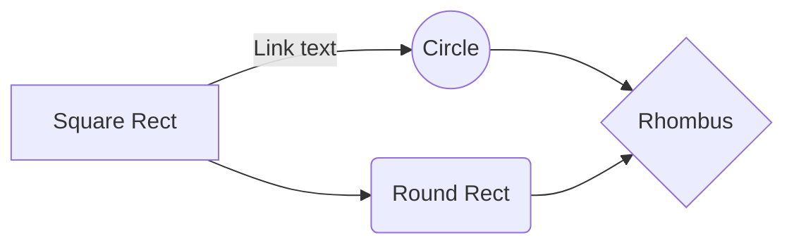

# Google-Maps-API-App
The app is implemented with the Google Maps API. 

## How to run the project:

##### Install mongodb

  1. create directory for mongo [like: C:\mongo]
  2. install mongodb global to the created directory `npm i mongodb -g`
  3. create directory for database [like: C:\mongo\db] }

##### Install dependencies
 ```
  npm i
 ```
##### Start mongo
  In console from mongo directory [C:\mongo\server\bin] type 
  ```
  mongod --dbpath=\mongo\db
  ```
##### Connect to/Create database
  In console from mongo directory [C:\mongo\server\bin] type 
  ```
  mongo users
  ```

##### Run server
  `npm run server`or`node server`

## Links you may need:
  1. Google Maps API: https://developers.google.com/maps/documentation/javascript/?hl=en



